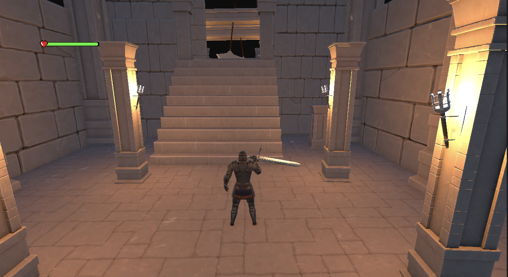

# Shadow of Blade (Unity)

[**GitHub Source Code**](https://github.com/shwan26/shadowofblade.git) 
---

## Project Name
**Shadow of Blade**

## Description
A Unity-built, third-person **sword-fighting** game where player **avoid deadly traps** and **defeat enemies and final boss**.

**Core Features**
- **Combat:** Sword attack.
- **Traps & Hazards:** Spike pits, swinging blades, collapsing floors, lava ground; timing & pathing challenges.
- **Boss Fight:** Cast falling swords.
- **UI/HUD:** Player HP.
- **Polish:** Sword trail VFX, hit sparks, camera shake on heavy blows.

> Unity Version:  6000.0.52f1
> Target Platform(s): Windows / macOS 

---

## Screenshots
Place screenshots in `./Screenshots/` and update the links below.

*Mid-fight with health bar.*

---

## Member Names
- Shwan Myat Nay Chi 
- Min Thuka
- Sein Win Htut

---

## Video

## Itich.io

## Licence

### Code
This repository’s **source code** (C# scripts and custom tools) is released under the **MIT License**.  
See [`LICENSE`](./LICENSE).

### Third-Party Assets (Unity Asset Store & others)
- **Unity Asset Store** assets are governed by the **Unity Asset Store EULA** and **cannot be redistributed** in this repository.  
- We **do not** include paid/downloaded Asset Store files here. Please acquire them via the Asset Store.

See [`THIRD_PARTY_NOTICES.md`](./THIRD_PARTY_NOTICES.md) for the list of third-party assets, publishers, and links.

---

## Quick Start
1. Clone the repo and open the project in **Unity 6000.0.52f1**.
2. Open scene: `Assets/Animation/Scene/MainMenu.unity`.
3. Press **Play**.
4. Controls: WASD (move), Mouse Move (camera), Mouse Click (attack).

---
